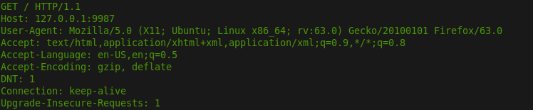

MultiThreaded-HTTP-Server
===
It is MultiThreaded Server means with help of threads from threadpool it can handle several request parallelly and serve them, if no. of client > no. of threads then it will put them into queue and serve them accordingly.

* Part1:**ThreadPool**
    * First a ThreadPool is implemented(A thread pool is a group of pre-instantiated, idle threads which stand ready to be given work)
    * It is implemented in  2 files i.e threadPool.h and threadPool.cpp ----> it is generic threadPool Library.
    * To create threads and mutex(to do synchronization) ,pthread library available in C is used.
    * To put the all threads to sleep or to avoid busy waiting ,condition variable is used.
    * Only 100 Maximum no. of threads allowed to create in threadPool, you can change it.

* Part2:**Server and Parse**
    * In this Section, just connection is created, create the threadPool and pass the request to Parse.cpp.
    * Parse.cpp we get the Request HTTP Header and read the information present in Http Header.
    * Then according to the request , We Prepare the Http response Header and read the data as requested and finally send the data.
    * Following are images are ScreenShot of HTTp Request and Response Header.
                                      
    

* ##### How To run
    1. first run makefile  to compile the all files -- make command
    2. write command in terminal ./main 9999(any portNo u can give in input)
        or
    2. run only with ./main (without argument then it will take default PortNo=9923)

